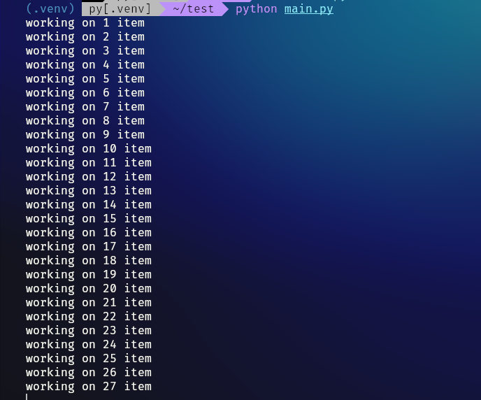

A small script to save your Etsy shop listings(images, price, description, etc) locally.

- [Download your Etsy Listings data](https://help.etsy.com/hc/en-us/articles/360000343508-How-to-Download-Your-Listing-Information)
- Store the downloaded file in `<work-dir>/etsy` directory.
- [Create a virtual env in python](https://packaging.python.org/en/latest/guides/installing-using-pip-and-virtual-environments/)
- Install required libraries using:
  - `pip install -r requirements.txt`

- Run `python main.py`
- 

TODO:
- Retry and resume support
- GUI
